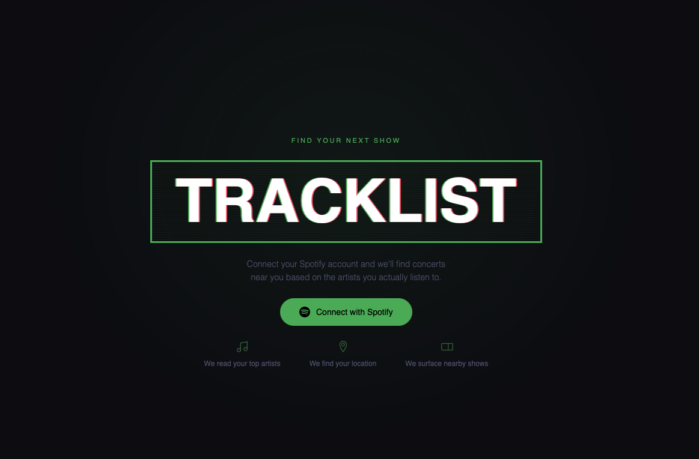
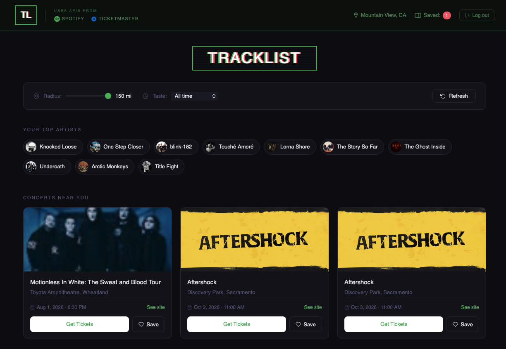

# Tracklist 🎟️

A full-stack web app that recommends nearby concerts based on your Spotify listening history. Connect your Spotify account, enter your zip code, and Tracklist finds upcoming shows for your top artists in your area — powered by the Spotify Web API and the Ticketmaster Discovery API.

---

## Screenshots

### Home



### After Login


### Demo

https://github.com/user-attachments/assets/1500fe5e-29d1-4d84-ac83-b1de436ada97

---

## Features

- **Spotify OAuth login** — securely connects to your Spotify account
- **Top artists** — pulls your most listened-to artists (all time, last 6 months, or last 4 weeks)
- **Nearby concerts** — searches Ticketmaster for upcoming shows based on your zip code
- **Adjustable radius** — search within 10 to 150 miles
- **Save favorites** — bookmark concerts you're interested in
- **Get Tickets** — links directly to Ticketmaster for purchasing
- **Logout** — clears your session and returns to the home screen

---

## Tech Stack

| Layer | Technology |
|---|---|
| Frontend | HTML, CSS, Vanilla JavaScript |
| Backend | Node.js, Express |
| Music data | Spotify Web API |
| Concert data | Ticketmaster Discovery API |
| Location lookup | Zippopotam.us (free, no key needed) |
| Favorites storage | Local JSON file (`data.json`) |

---

## Prerequisites

- [Node.js](https://nodejs.org) (LTS version recommended)
- A free [Spotify Developer](https://developer.spotify.com) account
- A free [Ticketmaster Developer](https://developer.ticketmaster.com) account

---

## Setup

### 1. Clone the repository

```bash
git clone https://github.com/yourusername/tracklist.git
cd tracklist
```

### 2. Install dependencies

```bash
npm install
```

### 3. Get your API keys

**Spotify:**
1. Go to [developer.spotify.com/dashboard](https://developer.spotify.com/dashboard)
2. Create an app named **Tracklist**
3. In Settings, add `http://127.0.0.1:3000/callback` as a Redirect URI
4. Copy your **Client ID** and **Client Secret**

**Ticketmaster:**
1. Go to [developer.ticketmaster.com](https://developer.ticketmaster.com)
2. Create an account and register an app
3. Copy your **Consumer Key**

### 4. Create your `.env` file

Create a file named `.env` in the root of the project:

```
SPOTIFY_CLIENT_ID=your_spotify_client_id
SPOTIFY_CLIENT_SECRET=your_spotify_client_secret
SPOTIFY_REDIRECT_URI=http://127.0.0.1:3000/callback
TICKETMASTER_API_KEY=your_ticketmaster_consumer_key
```

### 5. Add your Spotify Client ID to the frontend

Open `script.js` and update this line at the top:

```js
const SPOTIFY_CLIENT_ID = 'your_spotify_client_id';
```

### 6. Run the server

```bash
node server.js
```

Then open your browser and go to:

```
http://127.0.0.1:3000
```

---

## How It Works

1. Click **Connect with Spotify** and authorize the app
2. Enter your **zip code** when prompted
3. Tracklist fetches your top artists from Spotify
4. For each artist, it searches Ticketmaster for upcoming shows near you
5. Browse concerts, save favorites, and click **Get Tickets** to buy

---

## Project Structure

```
tracklist/
├── server.js       # Express backend — handles OAuth, proxies API calls
├── index.html      # Single page frontend
├── style.css       # All styling
├── script.js       # Frontend logic
├── data.json       # Saved favorites (local storage)
├── .env            # API keys (never commit this)
└── .gitignore      # Excludes .env and node_modules
```

---

## Notes

- IMPORTANT ⚠️⚠️⚠️ The `.env` file is excluded from version control via `.gitignore` — never commit your API keys ⚠️⚠️⚠️
- Spotify requires you to add yourself as a user under **Users and Access** in your app dashboard while in development mode
- Concert images are provided by Ticketmaster and may vary in quality

---

## Course

CS 351 — Web Development
